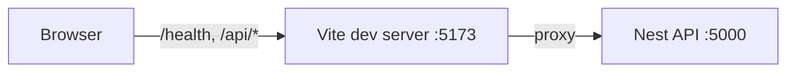
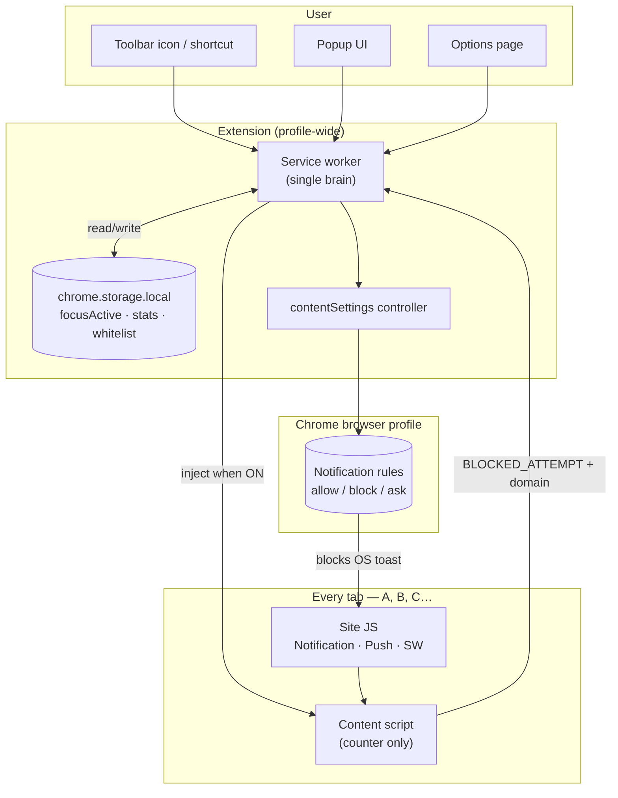
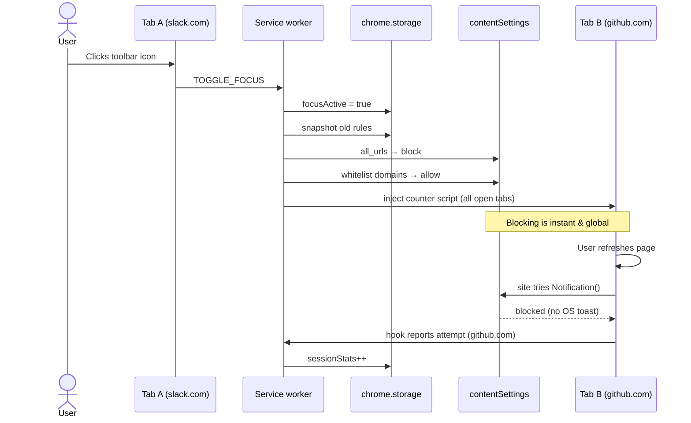
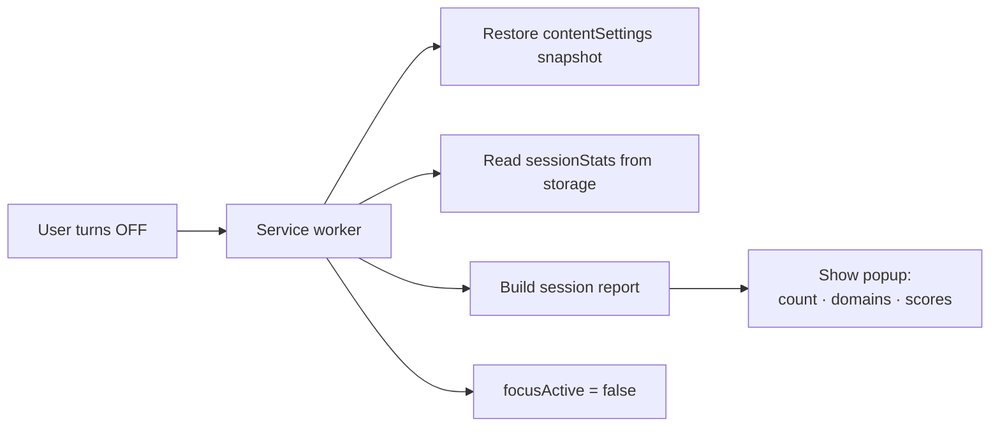
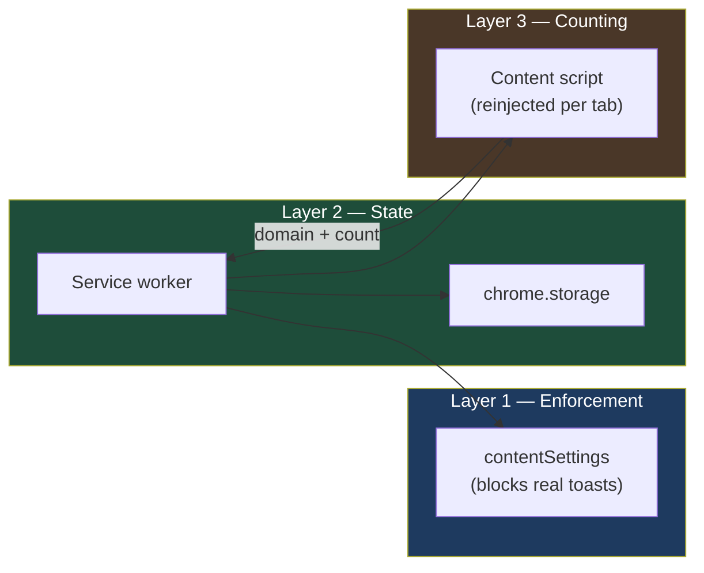
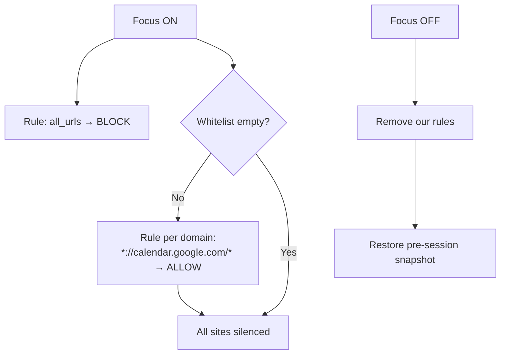
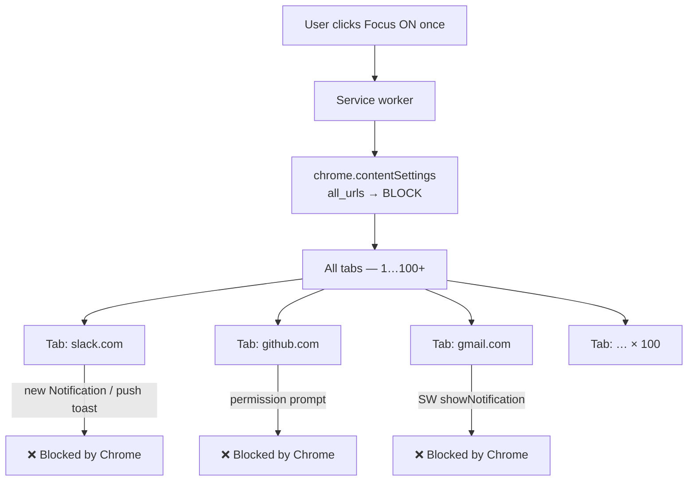
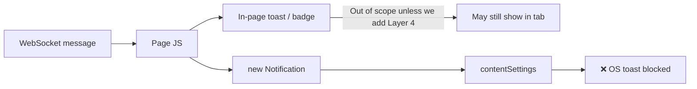
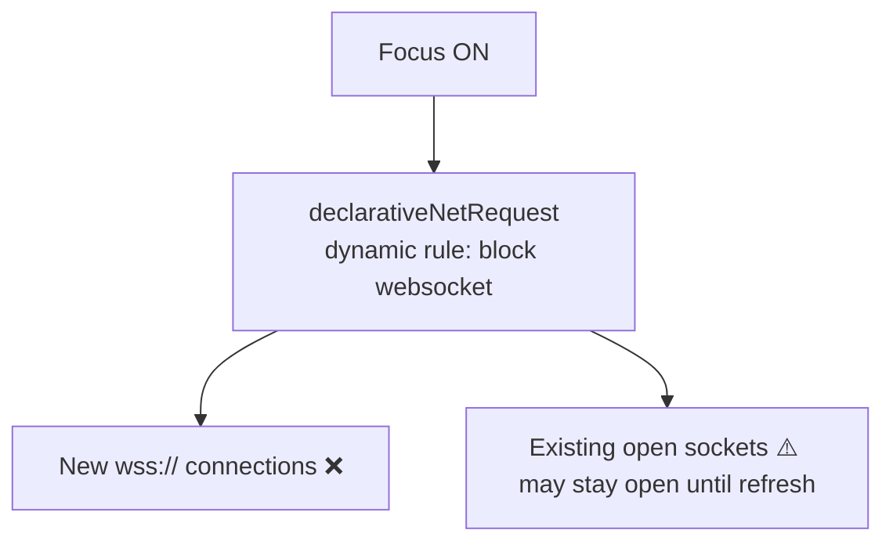
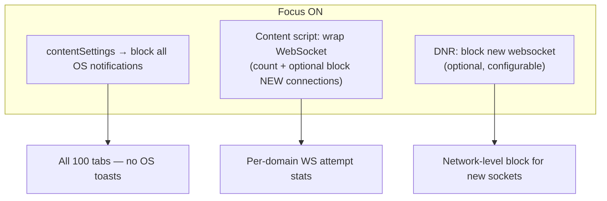

# Understanding existing code and repositories
_Exported on 10/06/2026 at 16:49:37 GMT+5 from Cursor (3.0.16)_

---

**User**

understand the full code and repos exisitng in current directory

---

**Cursor**

I'll map the workspace structure and use the knowledge graph to get an architectural overview of what's in this directory.


Checking the previous hackathon branch for prior feature work and any workspace-level files.


Here is a full picture of what lives in `/Users/brainxtechnologies/Desktop/Projects/hackathon-workspace`.

## Workspace layout

The workspace is **not** a single git repo. It contains **two sibling repositories**:

| Repo | Remote | Current branch |
|------|--------|----------------|
| `hackathon-task-backend` | `git@github.com:anees-rehman-brainx/hackthon-task.git` | `hackthon-3-june-10-2026` |
| `hackathon-task-frontend` | `git@github.com:anees-rehman-brainx/hackathon-task-frontend.git` | `hackthon-3-june-10-2026` |

Both repos were branched today from `main` for a new hackathon session. There is no root-level `package.json` or shared tooling — you run each repo independently.

---

## Current state (active branch: `hackthon-3-june-10-2026`)

Both repos were **reset to minimal starters** for this hackathon. The latest commits are:

- Backend: `chore: reset main to Nest starter for new hackathon work`
- Frontend: `chore: reset main to Vite/React starter for new hackathon work`

### Backend — NestJS API starter

**Stack:** NestJS 11, TypeScript, `@nestjs/config`, Express

**Source files (only 3):**

```
src/
├── main.ts           # Bootstrap, CORS, JSON body parser, port from env
├── app.module.ts     # ConfigModule + AppController
└── app.controller.ts # GET / and GET /health
```

**Endpoints:**
- `GET /` → `{ message: "Hackathon API starter", docs: "/health" }`
- `GET /health` → `{ ok: true, env: "development" }`

**Config** (`.env.example`):
- `PORT` (default 5000)
- `NODE_ENV`
- `CORS_ORIGIN` (optional)
- `DOTENV_CONFIG_PATH` (optional)

**Run:** `npm run dev` (port 5000)

> Note: `dist/` still contains compiled output from the **previous** hackathon (`brief-tickets`, `openai` modules). That is stale — current `src/` no longer has those modules.

---

### Frontend — Vite + React starter

**Stack:** React 19, Vite 6, Axios

**Source structure:**

```
src/
├── main.jsx              # React entry
├── app/
│   ├── App.jsx           # Health-check demo page
│   └── app.css
├── api/
│   ├── httpClient.js     # Axios instance (120s timeout)
│   └── index.js
├── config/
│   └── env.js            # VITE_API_BASE_URL logic
└── index.css
```

**What it does now:** On load, calls `GET /health` and shows the JSON response or an error.

**Dev proxy** (`vite.config.js`):



- `/api` and `/health` proxy to `VITE_PROXY_TARGET` (default `http://127.0.0.1:5000`)
- In dev, `getApiBaseUrl()` returns `""` (same-origin) so requests go through the proxy
- In prod, set `VITE_API_BASE_URL` to the deployed API origin

**Run:** `npm run dev` (port 5173)

---

## Previous hackathon work (`hackthon-2-may-13-2026`)

The prior session built a full **“Brief → Clarifications → Dev Tickets”** feature using OpenAI. That code is preserved on branch `hackthon-2-may-13-2026` in both repos.

### Backend (prior branch)

**Modules:**
- `OpenaiModule` / `OpenaiService` — chat completions with JSON output
- `BriefTicketsModule` — main feature

**API:**
| Method | Path | Purpose |
|--------|------|---------|
| `POST` | `/api/brief-tickets/analyze` | Analyze requirements; return clarifying questions or ready tickets |
| `POST` | `/api/brief-tickets/finalize` | Submit answers; generate final dev tickets |

**Extra deps:** `openai`, `zod`, `class-validator`, `class-transformer`

**Flow:**
1. User submits requirements text
2. OpenAI decides if clarifications are needed or tickets are ready
3. If clarifications needed → user answers → `finalize` generates structured tickets
4. Responses validated with Zod schemas

### Frontend (prior branch)

**Feature:** `src/features/brief-to-tickets/`

Multi-step wizard:
1. **Requirements** — paste project brief
2. **Clarifications** — answer AI-generated questions (skippable if none)
3. **Tickets** — view generated dev tickets

Components: `RequirementsForm`, `ClarificationForm`, `TicketList`, `LoadingPanel`, `ErrorBanner`

API client: `src/api/briefTickets.js` calling the backend endpoints above.

---

## Git history (high level)

**Backend evolution:**
1. Express API with OpenAI brief analysis
2. Migrated to NestJS (TypeScript)
3. Hackathon 2 feature work (brief-tickets)
4. Reset to starter on `main` / new branch

**Frontend evolution:**
1. Initial Vite React setup
2. Brief-to-tickets UI + Vite proxy fix
3. Reset to starter on `main` / new branch

---

## Environment & security note

The backend `.env` file contains an `OPENAI_API_KEY` and `OPENAI_MODEL` from the prior session. The **current starter code does not use OpenAI**, but the key is still on disk. Treat it as sensitive — do not commit `.env`, and rotate the key if it may have been exposed.

---

## How to run locally

```bash
# Terminal 1 — backend
cd hackathon-task-backend
npm install
npm run dev          # http://localhost:5000

# Terminal 2 — frontend
cd hackathon-task-frontend
npm install
npm run dev          # http://localhost:5173
```

The frontend health-check page should show `{ "ok": true, "env": "development" }` when both are running.

---

## Summary

You have a **hackathon starter kit** (NestJS + React) ready for new work on branch `hackthon-3-june-10-2026`, plus a **complete prior implementation** on `hackthon-2-may-13-2026` that turns product briefs into AI-generated dev tickets via a 3-step UI flow.

If you want to continue from the prior feature instead of starting fresh, check out `hackthon-2-may-13-2026` in both repos. If you want to build something new, the current starters give you health checks, CORS, env config, and a dev proxy already wired up.

---

**User**

Yes we will on this branch, new hackthone we have to do today

---

**Cursor**

Got it — we'll stay on **`hackthon-3-june-10-2026`** in both repos and build today's hackathon from the current starters.

**Starting point:**
- **Backend:** NestJS on port 5000 (`GET /`, `GET /health`, env/CORS ready)
- **Frontend:** Vite + React on port 5173 (dev proxy to backend, health-check page)
- **OpenAI config** is already in backend `.env` if we need it

**Not using** the prior `hackthon-2-may-13-2026` brief-to-tickets flow unless you want pieces of it reused.

What's today's hackathon task? Share the brief, requirements, or goal (even a rough idea), and we can plan and start building.

---

**User**

ok so lets start, first of all i am giving you high level requirements, we will both review and understand, we will do deep analysis of this, find out the requirements and create a plan document md file in which we lock the steps, for each task/sprint we will deep down into this, find the edge cases and multiple best approaches to implement, once i reviewed and give go go ahead then we will start implementing. also we will keep reviewing the tasks and keep brainstorming so at the end we have fully fldged single source of truth foe development.
below is the key requirements:
"
Chrome Extension — Focus Mode Activator

Build a Chrome extension that blocks all browser notification popups and push notifications with a single toolbar click. When Focus Mode is ON, no site can interrupt you. When turned OFF, a session summary shows how many notifications were blocked and from which sites.
Suggested additions worth planning:

Auto-schedule Focus Mode for specific hours daily
Per-domain distraction score showing how aggressively each site tried to interrupt
Keyboard shortcut to toggle without opening the popup
Whitelist for sites that should never be blocked
Flow: Click toolbar icon → Activate → All notifications silenced → Deactivate → View session report"

---

**Cursor**

Creating a planning document: analyzing Chrome extension APIs and constraints, then drafting the plan as our single source of truth.


I've created the planning document at **`FOCUS_MODE_PLAN.md`** in your workspace root. It’s meant to be our single source of truth — we’ll update it as we review, decide, and build.

## What the plan covers

1. **Requirements** — split into Must (R1–R6), Should (R7–R10), and non-functional
2. **Platform reality** — what Chrome can and can’t do (important for expectations)
3. **Architecture** — MV3 service worker + `contentSettings` blocking + content-script counting (hybrid)
4. **Per-feature deep dives** — multiple approaches, recommendations, and edge cases for each feature
5. **Locked sprint order** — Sprint 0 → 5 with exit criteria per sprint
6. **Data model** — storage schema for state, stats, whitelist, schedule
7. **Testing strategy** — local HTML fixtures + test matrix
8. **Decision log** — records choices as we lock them in

## Key technical call (proposed)

Chrome doesn’t emit events when it blocks a notification, so we need a **hybrid approach**:

| Layer | Role |
|-------|------|
| `chrome.contentSettings` | Actually blocks notifications (including push) |
| Content script hooks | Counts attempts per domain for the session report |

The existing **Nest/React repos are not needed for MVP** — the deliverable is a new `focus-mode-extension/` folder.

## Decisions I need from you (§10 in the doc)

| # | Question | My recommendation |
|---|----------|-------------------|
| **Q1** | Icon click toggles directly, or opens popup first? | **Toggle directly** (matches “single click”) |
| **Q2** | Incognito support? | **Spanning** — focus works in all windows |
| **Q3** | Manual OFF during scheduled hours? | **User wins** — stays off until next slot |
| **Q4** | Group stats by `slack.com` or `app.slack.com`? | **Full hostname** — more useful |
| **Q5** | How to show report if popup was closed? | **Badge + auto-open popup** on deactivate |
| **Q6** | MVP scope for demo? | **Sprint 0–3** (core + report + whitelist + shortcut); Sprint 4–5 if time allows |
| **Q7** | Where to put code? | **`focus-mode-extension/`** in this workspace |

## Proposed sprint order

```
Sprint 0 → Scaffold (manifest, icon, popup)
Sprint 1 → Toggle + real blocking
Sprint 2 → Counting + session report
Sprint 3 → Whitelist + keyboard shortcut
Sprint 4 → Auto-schedule + distraction score
Sprint 5 → Polish + ship
```

---

Please review `FOCUS_MODE_PLAN.md` and reply with:

1. Your answers to **Q1–Q7** (agree with recommendations or change them)
2. **MVP scope** — stop at Sprint 2, 3, or aim for full 5?
3. **Go-ahead** to start Sprint 0

Once you confirm, we’ll update the decision log and begin implementation. If anything in the plan should change — scope, UX flow, or technical approach — call it out and we’ll revise the doc first.

---

**User**

ok lets refine:
first of all no need to create a new branch focused for this we will work in current branch.
secondly what is the core mental model how exactly it suppressed the notifications of different types like sockets, push, toasts and others and how it maintians the allowed and restricted URLs? as i can see in refreshing the states it can lost and suppose user sits on domain A and he activate it then how storage be shared on all the tabs?

---

**Cursor**

Refining the plan: clarifying the core mental model (how suppression works, URL rules, and cross-tab state) and noting we stay on the current branch.


Updating the plan with branch clarification and a detailed core mental model section.


Good refinements — I've updated `FOCUS_MODE_PLAN.md` to **v0.2** with a full **§2 Core mental model** and locked the branch decision: we stay on `hackthon-3-june-10-2026` only.

Here is the core mental model in plain terms:

---

## One sentence

**Focus Mode is browser-wide, not tab-wide.** One service worker + `chrome.storage` + Chrome's `contentSettings` rules — not the page you were on when you clicked.

---

## Three layers (each with a different job)

| Layer | What it is | Job |
|-------|------------|-----|
| **1. `contentSettings`** | Chrome profile rule table | **Actually stops** OS notification toasts & permission prompts |
| **2. Service worker + `chrome.storage.local`** | Extension brain | **Remembers** ON/OFF, whitelist, session counts — shared by all tabs |
| **3. Content scripts** | Code injected per tab | **Counts** attempts for the report — disposable, re-created on refresh |

Content scripts do **not** own state. They die on refresh. That's fine — blocking still works because **layer 1** lives in Chrome's profile, and **layer 2** survives in storage.

---

## What we block vs what we don't

| Type | Blocked? |
|------|----------|
| OS desktop toast (`new Notification()`) | **Yes** |
| Permission prompt (`requestPermission()`) | **Yes** |
| Web Push → service worker → `showNotification()` | **Yes** (toast blocked; push may arrive but can't surface) |
| WebSockets / SSE | **No** — not notifications |
| In-page banners (DOM/React toasts) | **No** — not browser notifications |
| Tab title `(3) Gmail` | **No** |

**Push vs sockets:**

```
Push:     Server → Site SW → showNotification() → OS popup   ✅ blocked
WebSocket: Server ↔ Page JS → maybe a <div> inside the page    ❌ not our layer
```

If a site uses a socket and then calls `new Notification()`, we block the toast — not the socket.

---

## Allow / restrict URLs — how it works

We don't maintain a per-session "block list." When focus is **ON**:

```
<all_urls>  →  block          (everyone silenced)
whitelist   →  allow per domain (exceptions only)
```

- **Restrict** = implicit global block (one rule)
- **Allow** = whitelist stored in `chrome.storage.local`, applied as more-specific `allow` rules that override the global block
- Session report domains = **telemetry** (who tried), not a permission list

Rules live in **Chrome's profile**, not in any tab. Refreshing domain A does **not** clear them.

---

## Your scenario: activate on domain A — what happens to all tabs?

```
1. User on app.slack.com clicks icon
2. Popup messages service worker (not the page)
3. SW writes focusActive: true → chrome.storage.local  ← global
4. SW sets contentSettings <all_urls> → block           ← global
5. SW applies whitelist allow rules if any               ← global
6. SW injects counter scripts into open tabs

Tab B (github.com) refreshes:
  - contentSettings still block ✅ (unchanged by refresh)
  - content script reinjects on load ✅
  - reads focusActive from storage ✅

New tab C opens:
  - same global rules apply immediately
  - content script runs on first navigation
```

**Tabs don't share state through the page.** They all talk to the same extension storage. Domain A is only where the user clicked — it doesn't "own" the session.

---

## What survives refresh / restart?

| | Tab refresh | Browser restart |
|---|-------------|-----------------|
| Focus ON/OFF | **Keeps** | **Keeps** |
| Block rules | **Keeps** | **Keeps** |
| Session counts | **Keeps** | **Keeps** |
| Content script in that tab | Recreated | Recreated |

On browser restart, the service worker reads `focusActive` from storage and re-applies rules if still ON.

---

## Common misconception cleared

> "Refreshing might lose state"

**Wrong** for focus mode itself. Only the **in-tab hook script** is recreated — which we design for. The enforcement (`contentSettings`) and truth (`storage`) persist.

---

The full write-up with diagrams, walkthrough, and cheat sheet is in **`FOCUS_MODE_PLAN.md` §2**.

**Questions for you before we lock further:**

1. Is the **WebSocket / in-page toast** boundary acceptable for the hackathon scope?
2. Does the **global-not-per-tab** model match what you want users to experience?
3. Any other interruption types you want explicitly in or out of scope?

Once you're happy with §2, we can answer the remaining Q1–Q7 items and move to Sprint 0.

---

**User**

give a quick architecture flow daigaram here then i will answer you

---

**Cursor**

## Focus Mode — Architecture at a glance

### System components



---

### Activate flow (user on domain A)



---

### Deactivate + session report



---

### Three layers — who does what



---

### Allow / block rule model



---

**Takeaway:** Icon click → service worker → storage + Chrome rules (global) → all tabs affected. Content scripts only count; they don't own state.

When you're ready, answer:
1. WebSocket / in-page toast boundary — OK for scope?
2. Global (all tabs) behavior — what you want?
3. Remaining Q1–Q7 from the plan (or "agree with recommendations")

---

**User**

If i say web sockets is in scopes then how these will be handled?
with all tabs is the same as global restriction on chrome, suppose there are hunred of tabs opens and user active the focsu mode, so any kind of notifications should not be received

---

**Cursor**

## 1. All tabs = global Chrome restriction (100 tabs case)

Yes — **that is exactly the model.**

When focus turns ON, we do **not** loop 100 tabs to “turn off notifications” one by one. We write **one profile-wide rule**:

```
contentSettings.notifications:  <all_urls> → block
```

That applies **instantly to every tab** — open, background, pinned, or not yet loaded.



| Question | Answer |
|----------|--------|
| Must we visit each tab to block? | **No** — Chrome enforces globally |
| New tab opened while ON? | Blocked immediately (rule already active) |
| Tab refresh while ON? | Still blocked (`contentSettings` persists) |
| What are content scripts for? | **Counting** for session report + optional extra hooks — not the primary blocker |
| 100 tabs — injection slow? | Blocking works **before** injection finishes; we inject counters in background |

**Result:** With focus ON, **no site in any tab should receive OS-level notification toasts or permission prompts.** That matches your requirement.

---

## 2. If WebSockets are in scope — how we handle them

Important distinction first:

| Path | What it is | Same as OS notification? |
|------|------------|----------------------------|
| Web Push | Server → site service worker → `showNotification()` | **Yes** — already blocked by `contentSettings` |
| WebSocket | Server ↔ page live connection (messages, chat, live data) | **No** — it’s a **transport**, not a notification |

Many apps use WebSockets like this:

```
WebSocket message arrives
    ├─► Update UI in page (Slack banner)     ← in-page, not OS toast
    ├─► Play sound                           ← not a notification
    └─► Sometimes call new Notification()    ← already blocked today
```

So “WebSockets in scope” can mean two very different things:

---

### Option A — Block notification *outcomes* from WebSockets (recommended)

**Goal:** User isn’t interrupted, but sites still mostly work.



| Layer | Handles |
|-------|---------|
| `contentSettings` | OS toasts + push + permission prompts — **all tabs** |
| Content script hook on `Notification` | Count attempts |
| WebSocket | **Left connected** — we don’t kill live apps |

**Tradeoff:** Slack-style **in-page** banners may still appear inside the tab (no OS popup).

---

### Option B — Block WebSocket *connections* entirely (nuclear)

**Goal:** Stop real-time traffic so nothing can arrive over sockets.



**How (technical):**

```js
// When focus ON — dynamic DNR rule (conceptual)
{
  action: { type: "block" },
  condition: {
    urlFilter: "*",
    resourceTypes: ["websocket"]
  }
}
```

Plus optionally in content scripts:

```js
// Wrap constructor — block new connections from page JS
window.WebSocket = function (...args) {
  reportAttempt(location.hostname);
  throw new Error("Focus Mode: WebSocket blocked");
};
```

| Pros | Cons |
|------|------|
| Stops socket-delivered data entirely | **Breaks** Slack, Discord, Figma, Google Docs, live dashboards |
| Strong “nothing gets through” feel | 100 tabs may all show stale/broken state |
| | Existing sockets may need tab refresh to fully cut |
| | Whitelist becomes critical (allow `wss://` per domain) |

---

### Option C — Hybrid (practical if WebSockets must be in scope)



| Mode | Behavior |
|------|----------|
| **Default** | Block OS notifications globally; **monitor** WebSocket connects (count only) |
| **Strict focus** (toggle in options) | Also block new WebSocket connections via DNR + JS hook |
| **Whitelist** | `calendar.google.com` can keep both notifications **and** sockets |

---

## 3. Side-by-side: what 100-tab focus blocks

| Interruption type | Global block (all tabs)? | Mechanism |
|-------------------|--------------------------|-----------|
| OS desktop toast | **Yes — instant** | `contentSettings` |
| Permission prompt | **Yes — instant** | `contentSettings` |
| Web Push → toast | **Yes — instant** | `contentSettings` |
| In-page DOM toast from WS | **No** (unless we add DOM layer) | — |
| WebSocket messages | **Only if Option B/C strict** | `declarativeNetRequest` + JS hook |
| Tab title `(3)` / favicon badge | **No** | Out of scope |

---

## 4. What I need you to decide

**Q-WS1:** When you say WebSockets in scope, do you mean:

| Choice | Meaning |
|--------|---------|
| **A** | Block only **OS notifications** (including push) — WebSockets keep working; in-page banners may still show |
| **B** | **Kill WebSocket connections** during focus — nothing real-time gets through (apps may break) |
| **C** | **Hybrid** — default A, optional “Strict mode” enables B |

**Q-WS2:** For in-page toasts (Slack banner inside the tab, not OS popup) — in or out of scope?

---

My recommendation for a hackathon demo that matches *“no notifications received”* without breaking the whole browser:

- **Lock:** Global OS notification block (100 tabs ✅) — already in plan  
- **WebSockets:** **Option C** — count by default, strict block as optional power feature  
- **In-page toasts:** Out of MVP unless you explicitly want a fragile DOM-suppression layer

Once you pick A / B / C (and in-page toasts in/out), I’ll update `FOCUS_MODE_PLAN.md` §2 and §11 and we can proceed to Sprint 0.

---

**User**

agreed, the websocket inblock notification should be restricted as these are not disturbing.
Now time to move towards implementations.
for the implementation we will work step by step for each pahse and test it first.
for each task you will give me quick summary here, i will provide feedback and then give u go ahead.
upto yet we need to follow the best practices of the code, optimization, proper files/folder as given per plan, reusability componenet, error handlings.

---

**Cursor**

Locking agreed decisions in the plan, then presenting Sprint 0 as a reviewable task summary — no code until you give the go-ahead.


Good — decisions are locked and the plan is updated to **v0.3**. Here is **Sprint 0** for your review. I will **not write code** until you say go-ahead.

---

## Sprint 0 — Setup & scaffold

**Goal:** A loadable Chrome extension skeleton that installs cleanly and proves our dev workflow.

**Exit criteria:** Extension installs in Chrome → icon visible → popup opens → service worker alive.

---

### What gets created

```
focus-mode-extension/
├── manifest.json                 # MV3, permissions stubbed for later sprints
├── icons/
│   ├── icon-16.png
│   ├── icon-48.png
│   └── icon-128.png              # + OFF state variants (or badge-only for MVP)
├── src/
│   ├── background/
│   │   └── service-worker.js     # entry: startup log + message router stub
│   ├── popup/
│   │   ├── popup.html
│   │   ├── popup.js
│   │   └── popup.css
│   └── shared/
│       ├── messages.js           # MSG.* constants
│       ├── storage.js            # get/set wrapper with error handling
│       └── logger.js             # consistent SW/popup logging
└── README.md                     # load-unpacked instructions
```

Options page, content scripts, and feature modules come in later sprints — not Sprint 0.

---

### Task breakdown

| Task | What we build | Why |
|------|---------------|-----|
| **S0.1** | `manifest.json` (MV3) | Declare SW, popup, icons, permissions placeholders (`storage` only for now) |
| **S0.2** | Service worker entry | Boots on install/startup; logs; stub message handler |
| **S0.3** | Popup UI (placeholder) | Shows "Focus Mode — OFF" + disabled-looking activate button (wired in Sprint 1) |
| **S0.4** | Icons | 16/48/128px — simple focus on/off or single icon + badge later |
| **S0.5** | README + test steps | How to load unpacked in `chrome://extensions` |

---

### Best practices applied in Sprint 0

- **ES modules** in SW/popup where Chrome allows (`"type": "module"` in manifest)
- **`shared/storage.js`** — single place for `chrome.storage.local` with try/catch
- **`shared/messages.js`** — message type constants from day one
- **`shared/logger.js`** — `[focus-mode]` prefixed logs for easy debugging
- **No business logic yet** — scaffold only, so Sprint 1 stays clean

---

### Permissions in Sprint 0 (minimal)

```json
"permissions": ["storage"]
```

`contentSettings`, `scripting`, `tabs`, `alarms` added in Sprint 1+ when needed — keeps install prompt smaller during scaffold testing.

---

### How you test (after I implement)

1. Open `chrome://extensions` → Enable **Developer mode**
2. **Load unpacked** → select `focus-mode-extension/`
3. Confirm: no manifest errors
4. Click toolbar icon → popup opens with placeholder UI
5. Open **Service worker** link → console shows startup log
6. Reload extension → startup log appears again (idempotent)

---

### What Sprint 0 does NOT include

- Focus toggle / blocking
- Content scripts
- Options page
- Session report
- Backend/frontend repos (unchanged)

---

### After Sprint 0 → Sprint 1 preview

Next phase: focus state manager + `contentSettings` global block + icon toggle + badge ON/OFF.

---

**Reply with:**
1. Any feedback or changes to the Sprint 0 scope/structure  
2. **Go-ahead** when ready for me to implement and run the test steps

---

**User**

yes go ahead,

---

**Cursor**

Implementing Sprint 0: creating the extension scaffold per the plan.


Generating extension icons and validating the manifest.


**Sprint 0 is done.** Here’s what was built and how to verify it.

## Created: `focus-mode-extension/`

```
focus-mode-extension/
├── manifest.json              # MV3, storage permission, module SW
├── icons/                     # 16 / 48 / 128 PNG
├── src/
│   ├── background/service-worker.js   # startup + PING/GET_STATE handlers
│   ├── popup/                         # placeholder UI
│   └── shared/                        # messages, storage, logger
└── README.md
```

## What works now

| Piece | Behavior |
|-------|----------|
| **Service worker** | Logs `[focus-mode] [service-worker] Service worker ready` on boot |
| **Popup** | Shows Focus OFF state, connects via PING → GET_STATE |
| **Storage wrapper** | `getFocusState()` with error handling (ready for Sprint 1) |
| **Messages** | `MSG.PING`, `MSG.GET_STATE` constants |
| **Toggle button** | Visible but disabled — wired in Sprint 1 |

## Your test steps

1. Open `chrome://extensions` → **Developer mode** ON  
2. **Load unpacked** → select  
   `/Users/brainxtechnologies/Desktop/Projects/hackathon-workspace/focus-mode-extension`  
3. Click the toolbar icon → popup should show **"Focus Mode — OFF"**  
4. Status line should be green: **"Extension connected · Sprint 0 scaffold"**  
5. On extensions page → **Service worker** → console should show startup log  

---

Please run those steps and confirm:
- **Pass** → I’ll post **Sprint 1 summary** (toggle + global notification block) for your go-ahead  
- **Fail** → tell me the error and I’ll fix it

---

**User**

you created a separate directory of focus-mode-extension is the extensions demands it?
Yes fine, i can see the extension in the unpacked load and loaded, now first of all change its heading and content and more polish it then move next.
beside these one more thing if you change each time , will i need to load again or just refresh??

---

**Cursor**

Clarifying reload behavior, then polishing the popup UI.


## Separate folder — is it required?

**No.** Chrome does not require a folder named `focus-mode-extension`. You can load **any folder** that contains a valid `manifest.json`.

We used a separate directory because:
- The hackathon workspace has **two git repos** (Nest backend + React frontend) — the extension is a **different deliverable**
- Keeps extension code isolated from unrelated app code
- Matches the plan structure (§5.2)

We could move it inside `hackathon-task-frontend/` later if you prefer one repo — functionally identical.

---

## Reload vs refresh — quick answer

| You changed | What to do |
|-------------|------------|
| **Popup** (HTML/CSS/JS) | Close popup → click icon again. **No reload needed.** |
| **Service worker** | `chrome://extensions` → click **reload** on the extension |
| **manifest.json** | **Reload** extension |
| **Icons** | **Reload** extension |

**Load unpacked only once.** After that, use the **reload** button on the extension card — not load again.

For **this popup polish**: close the popup and reopen it — you should see the new UI immediately.

---

## Popup polish — what changed

- **Heading:** "Focus Mode" with status **"You're unprotected"** / **"Deep work protected"**
- **Status pill:** Off/On with colored dot
- **Stats row:** Blocked count + "All tabs" scope
- **Copy:** User-facing text (removed "Sprint 0 scaffold" dev wording)
- **Visuals:** Dark gradient, bell icon, refined button states
- **Manifest:** Name shortened to **"Focus Mode"**

Button is enabled — clicking shows a brief "ships in next update" message until Sprint 1 wires real toggle.

---

Reopen the popup and confirm the new look. When you're happy, say **go-ahead** and I'll post the **Sprint 1 summary** (real toggle + global notification blocking).

---

**User**

fine, agreed with separate repo.
change the ID from "jidjocnjbakoakiibmgadgdadhidnpkb" to "brainx-extension-focus-mode-hackthon'

---

**Cursor**

Chrome extension IDs can't be arbitrary strings — they're derived from a manifest `key`. Adding your slug as our internal ID and generating a stable manifest key. Checking the current setup:


Important clarification first: **Chrome does not allow a custom readable extension ID** like `brainx-extension-focus-mode-hackthon`. IDs are always 32 characters using only `a`–`p` (e.g. `jidjocnjbakoakiibmgadgdadhidnpkb`).

Here's what I did instead:

## What changed

| What | Value |
|------|--------|
| **Project slug** (our internal ID) | `brainx-extension-focus-mode-hackthon` |
| **Storage keys** | Prefixed, e.g. `brainx-extension-focus-mode-hackthon:focusState` |
| **Logs** | `[brainx-extension-focus-mode-hackthon] …` |
| **Chrome ID** (after reload) | `okbmpmgebcgnngjdecjflgjpnidccfji` — stable via manifest `key` |

New file: `src/shared/constants.js` — single source for the slug.

## Why two IDs?

- **Project slug** — human-readable, used in our code/storage (what you asked for)
- **Chrome ID** — platform-assigned from the public `key` in `manifest.json`; stays the same across reloads (unlike random unpacked IDs before)

## What you need to do

Because `manifest.json` changed, **reload the extension once** on `chrome://extensions`.

You should see:
- Old ID `jidjocn…` → gone  
- New stable ID `okbmpmgebcgnngjdecjflgjpnidccfji`

You do **not** need to load unpacked again.

---

If you want the slug visible in the popup footer (e.g. for debugging), say the word. Otherwise, confirm reload worked and we can move to **Sprint 1**.

---

**User**

slug should be shown on footer and move next

---

**Cursor**

Adding the slug to the popup footer, then implementing Sprint 1 (toggle + global notification blocking).


**Footer slug + Sprint 1 done.**

## Footer
Slug `brainx-extension-focus-mode-hackthon` shows in the popup footer (monospace, bordered). Close and reopen the popup to see it — no extension reload needed for popup-only changes.

## Sprint 1 — what works now

| Feature | Implementation |
|---------|----------------|
| **Toggle focus** | Popup button → `TOGGLE_FOCUS` → service worker |
| **Global block** | `contentSettings` `<all_urls>` → `block` |
| **Restore on OFF** | `contentSettings.clear()` releases control |
| **Badge** | `ON` when active |
| **Persist + restart** | `syncFocusEnforcement()` on startup/install |
| **Errors** | Rollback block if storage fails |

**New files:** `focus-state.js`, `content-settings.js`, `errors.js`, test fixture

---

## Important: reload once

Because `manifest.json` gained `contentSettings`, go to `chrome://extensions` and **reload** the extension.

---

## Test Sprint 1

1. Open `focus-mode-extension/test/fixtures/basic-notification.html` in Chrome  
2. Focus **OFF** → **Show notification** (may show OS toast)  
3. Popup → **Enter Focus Mode** → badge **ON**, UI turns green  
4. Focus **ON** → **Show notification** again → **no OS toast**  
5. **Exit Focus Mode** → notifications work again  

Also check: footer shows slug, popup copy updates ON/OFF.

---

Confirm Sprint 1 passes and we’ll move to **Sprint 2** (counting blocked attempts + session report).

---

**User**

the slug and key is not owkring and i will recommend you to remove the approach of .pem key as it disturbing the other flow saying:
"
This extension includes the key file '/Users/brainxtechnologies/Desktop/Projects/hackathon-workspace/focus-mode-extension/extension-key.pem'. You probably don't want to do that.
"

we can tackle this at end.

---

**Cursor**

Removing the PEM/key approach and fixing the slug footer.


Removing the PEM/key setup and making the slug visible in HTML so it doesn't depend on JS loading.


Done. Here’s what changed:

## Removed PEM / manifest `key` approach
- Deleted `extension-key.pem`
- Removed `"key"` from `manifest.json`
- Chrome should no longer show the “includes the key file” warning

Stable Chrome extension ID is **deferred to final packaging** (Sprint 5 / ship).

## Fixed slug in footer
The slug was empty because it relied on JS only (`<code>` with no text). It’s now **in HTML directly** so it always shows:

```
Extension ID
brainx-extension-focus-mode-hackthon
```

Still defined in `constants.js` for storage/logs — keep both in sync if you rename later.

---

## What you need to do

1. **Reload** the extension on `chrome://extensions` (manifest changed — `key` removed)
2. Close popup → reopen
3. Confirm footer shows the slug and the PEM warning is gone

---

Sprint 1 blocking should still work after reload. Once you confirm, we can move to **Sprint 2** (blocked count + session report).

---

**User**

done move next phase, 

---

**Cursor**

Implementing Sprint 2: notification counting, session stats, and the deactivate report UI.


Adding `file://` permission so the local test fixture can receive content-script hooks.


**Sprint 2 is implemented.** Reload the extension once (new permissions: `scripting`, `tabs`, `file://` for local test page).

## What's new

| Feature | Details |
|---------|---------|
| **Content script hook** | Wraps `Notification` + `requestPermission` to count attempts |
| **Dynamic injection** | Registers script on focus ON; injects into open tabs |
| **Live counter** | Popup “Blocked this session” updates in real time |
| **Badge** | Shows count (or `ON` if zero) while focus active |
| **Session report** | On **Exit Focus Mode** → summary with duration, total, top sites |
| **Empty session** | “Quiet session — no interruption attempts detected” |
| **Done button** | Dismisses report back to main view |

## New / updated files

```
src/content/notification-hook.js
src/background/stats.js
src/background/injection.js
src/shared/domains.js
```

## How to test

1. **Reload** on `chrome://extensions`
2. Open `test/fixtures/basic-notification.html`
3. **Enter Focus Mode**
4. Click **Show notification** several times (+ **Request permission**)
5. Popup counter should increase; badge updates
6. **Exit Focus Mode** → report shows totals by site
7. Click **Done**

**Note:** After reload, re-enter focus mode so hooks inject into the test tab (or refresh the test page while focus is ON).

---

Confirm Sprint 2 works and we’ll move to **Sprint 3** (whitelist + keyboard shortcut).

---

**User**

Yes great, I can test the version 0.3 with selection of all sites and custom input of adding restriction.
butunable to open the "test/fixtures/basic-notification.html" 

---

**Cursor**

Making the test page easy to open: adding an in-extension "Open test page" action and clearer instructions — `file://` paths are often blocked or awkward in Chrome.


**Why the file path didn’t work**

Chrome often blocks or limits `file://` pages (notifications, extension injection). Opening  
`test/fixtures/basic-notification.html` from Finder or a raw path is unreliable.

**Easier way (added now)**

1. **Reload** the extension on `chrome://extensions`
2. Open the popup → click **Open notification test page** (footer)
3. A new tab opens from the extension — no file path needed
4. **Enter Focus Mode** → use the test buttons → **Exit** for the report

The test page is bundled inside the extension and opened via `chrome-extension://…/test/fixtures/basic-notification.html`.

---

**Manual fallback (macOS terminal)**

```bash
open "/Users/brainxtechnologies/Desktop/Projects/hackathon-workspace/focus-mode-extension/test/fixtures/basic-notification.html"
```

Or Chrome → **File → Open File…** and pick `basic-notification.html`. The popup button is still the better option.

---

**Tip:** Open the test page **before** or **after** entering focus mode. If focus is already ON, refresh the test tab once so hooks inject.

Reload the extension, use the footer button, and confirm the test tab opens. Then we can continue to **Sprint 3** (whitelist + keyboard shortcut).

---

**User**

there is no footer having open nitification test page.
you should change the version to 0.4 so we know changes reflcted.
the service worker giivng below e=warning and data:
"
brainx-extension-focus-mode-hackthon] [injection] Unregister content script Error: Nonexistent script ID 'focus-notification-hook'
write @ logger.js:14Understand this warning
2logger.js:16 [brainx-extension-focus-mode-hackthon] [focus-state] Focus enforcement synced — OFF
logger.js:14 [brainx-extension-focus-mode-hackthon] [service-worker] Service worker ready ObjectfocusActive: falsesessionStartedAt: null[[Prototype]]: Object"

---

**Cursor**

Fixing the missing test-page button, bumping the version to 0.4, and silencing the unregister warning when the content script isn't registered.


Moving the test button above the fold, adding a visible v0.4 label, and fixing the unregister warning.


Fixed all three items:

## 1. Version **0.4.0**
- Updated in `manifest.json`
- Popup header shows **`Focus Mode · v0.4.0`** (reads from manifest)

## 2. **Open notification test page** — moved up
It was in the footer, which was **below the popup fold** (cut off). It’s now a **second button directly under “Enter Focus Mode”** — you should see it without scrolling.

## 3. Service worker warning — fixed
`Nonexistent script ID 'focus-notification-hook'` happened when turning focus OFF before the script was ever registered. We now **check if it exists before unregistering** — no more warning.

---

## About those service worker logs (normal)

| Log | Meaning |
|-----|--------|
| `Focus enforcement synced — OFF` | Startup check: focus is off, rules cleared |
| `Service worker ready { focusActive: false }` | Extension loaded successfully |

These are **info**, not errors.

---

## What you need to do

1. Go to `chrome://extensions`
2. Click **Reload** on Focus Mode (manifest changed → **must reload**, not just reopen popup)
3. Confirm version shows **0.4.0** on `chrome://extensions`
4. Open popup → you should see:
   - `Focus Mode · v0.4.0` in the header
   - **Open notification test page** under the main green button

If you still see 0.3.0, the reload didn’t apply — click reload again on the extension card.

---

**User**

time up, we will resume from here next week for now creat a md file for all chat history we did, if you can exprt then go ahead i will paste.

---

**Cursor**

Creating a session resume document capturing our work, decisions, and next steps for next week.


Created **`FOCUS_MODE_SESSION_RESUME.md`** at:

`/Users/brainxtechnologies/Desktop/Projects/hackathon-workspace/FOCUS_MODE_SESSION_RESUME.md`

It’s a handoff doc you can paste or share next week. It includes:

1. **Project summary** — what Focus Mode does and what’s out of scope  
2. **Workspace layout** — extension vs Nest/React repos  
3. **Core mental model** — 3 layers, global blocking, WebSockets decision  
4. **All locked decisions** — branch, slug, no `.pem`, hybrid blocking, workflow  
5. **Progress** — Sprint 0–2 done, v0.4 fixes, Sprint 3–5 pending  
6. **File structure** — current extension tree  
7. **Storage keys & message types** — quick reference  
8. **How to run/test** — reload rules, v0.4 verification  
9. **Chat timeline** — what we did each phase  
10. **Known issues** — fixes applied  
11. **Resume checklist** — start Sprint 3 next week  

Companion docs:
- **`FOCUS_MODE_PLAN.md`** — full spec & sprints  
- **`focus-mode-extension/README.md`** — dev/testing  

Next week: open `FOCUS_MODE_SESSION_RESUME.md`, reload the extension (0.4.0), smoke test, then Sprint 3 (whitelist + keyboard shortcut). Good progress today.

---

**User**

no create a md file "Cursor chat history" in focus mode directory under docs folder and oput all other docs in it

---

**Cursor**

Organizing documentation into `focus-mode-extension/docs/` and creating the Cursor chat history file.


Done. All documentation is now under **`focus-mode-extension/docs/`**:

```
focus-mode-extension/docs/
├── README.md                    # Index of all docs
├── Cursor chat history.md       # ★ Full session log (paste/share this)
├── FOCUS_MODE_PLAN.md           # Moved from workspace root
├── FOCUS_MODE_SESSION_RESUME.md # Moved from workspace root
└── DEV_GUIDE.md                 # Load, reload, test steps (from README)
```

**Root `focus-mode-extension/README.md`** is slim and links to `docs/`.

**Removed from workspace root:**
- `FOCUS_MODE_PLAN.md`
- `FOCUS_MODE_SESSION_RESUME.md`

**Main file to paste next week:**  
`focus-mode-extension/docs/Cursor chat history.md` — full chronology, user messages, decisions, implementation, issues, and Sprint 3 next steps.


only for testing