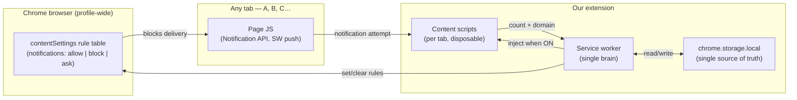
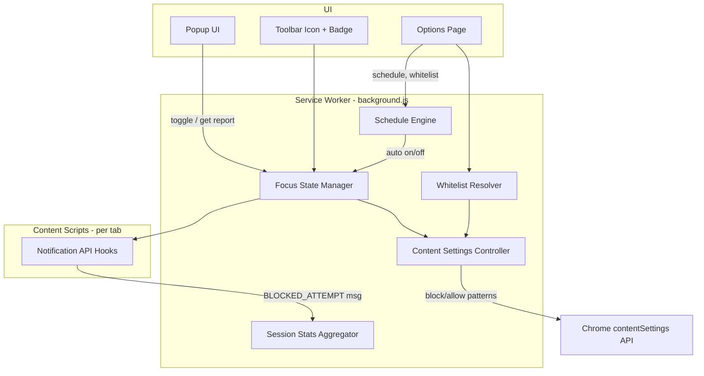

# Focus Mode Activator — Development Plan

> **Status:** v0.3 — implementation phase (step-by-step, test each sprint)  
> **Branch:** `hackthon-3-june-10-2026` only — **no separate feature branch**; all work commits here  
> **Last updated:** 2026-06-10  
> **Owner:** Hackathon team  
> **Purpose:** Single source of truth for requirements, architecture, sprints, edge cases, and implementation decisions.

---

## Table of contents

1. [Product summary](#1-product-summary)
2. [Core mental model](#2-core-mental-model) ← **read this first**
3. [Requirements](#3-requirements)
4. [Platform constraints & honest limitations](#4-platform-constraints--honest-limitations)
5. [Recommended architecture](#5-recommended-architecture)
6. [Data model & storage](#6-data-model--storage)
7. [Feature deep dives](#7-feature-deep-dives)
8. [UX flows](#8-ux-flows)
9. [Sprint plan (locked order)](#9-sprint-plan-locked-order)
10. [Testing strategy](#10-testing-strategy)
11. [Risks & open questions](#11-risks--open-questions)
12. [Decision log](#12-decision-log)
13. [Out of scope (for now)](#13-out-of-scope-for-now)

---

## 1. Product summary

### Problem
Browser notifications (permission prompts, desktop toasts, push from service workers) interrupt deep work. Users need a **one-click** way to silence the entire browser and understand what was blocked afterward.

### Solution
A **Chrome extension (Manifest V3)** with a toolbar toggle:

```
Click icon → Focus ON  → all site notifications silenced
Click again → Focus OFF → session report (count + per-site breakdown)
```

### Relationship to existing repos

| Repo | Role for this hackathon |
|------|-------------------------|
| `hackathon-task-backend` (NestJS) | **Not required for MVP** — extension is self-contained |
| `hackathon-task-frontend` (Vite/React) | **Not required for MVP** — extension UI lives in popup/options |
| **New folder:** `focus-mode-extension/` | **Primary deliverable** — documentation in `docs/` |

> We can add a web dashboard later (optional stretch). MVP = installable Chrome extension only.

---

## 2. Core mental model

This section answers: *what exactly gets suppressed, how allow/block rules work, what survives a refresh, and how one click on domain A affects every tab.*

### 2.1 The three actors (who owns what)

Focus Mode is **not** tab-local state. Nothing important lives only inside the page the user was on when they clicked the icon.



| Actor | Role | Survives tab refresh? | Survives browser restart? |
|-------|------|----------------------|---------------------------|
| **Service worker** | Decides ON/OFF, applies rules, aggregates stats | Yes (restarts, but reloads from storage) | Yes |
| **`chrome.storage.local`** | `focusActive`, whitelist, session counts, snapshot | Yes | Yes |
| **`chrome.contentSettings`** | Browser-enforced block/allow per URL pattern | Yes | Yes |
| **Content script in a tab** | Hooks `Notification` API to **count** attempts | **No** — re-injected on each navigation | Re-injected when tab loads |

**Key insight:** The user clicks the icon on domain A, but the **service worker** turns focus on for the **entire browser profile**. Domain A is irrelevant to where state lives.

---

### 2.2 Notification types — what we block vs what we do not

Sites interrupt users in many ways. Our extension targets **Chrome desktop notification permission and delivery**, not all real-time traffic.

| Interruption type | Under the hood | In scope? | How we handle it |
|-------------------|----------------|-----------|------------------|
| **Desktop toast** (OS popup) | `new Notification("…")` or `registration.showNotification()` | **Yes** | `contentSettings` blocks delivery; content script counts the attempt |
| **Permission prompt** ("Allow notifications?") | `Notification.requestPermission()` | **Yes** | Global `block` prevents the prompt; content script counts it |
| **Web Push** (server → service worker → toast) | Push event in site SW → `showNotification()` | **Yes** | Browser blocks at notification layer (same `contentSettings` type) — push may arrive but **toast must not show** |
| **In-page toast** (Slack-style banner inside the page) | DOM / React component | **No** | Not a browser notification — we cannot block without breaking the page |
| **WebSockets / SSE** | Persistent connection, messages to JS | **No** | Not notifications; site may *choose* to show an in-page UI — out of scope |
| **Tab badge / title flash** `(1) Gmail` | `document.title` / favicon | **No** | Out of scope for MVP |
| **Sound** | `<audio>` / Web Audio | **No** | Out of scope |
| **Other extensions' popups** | `chrome.notifications` from another extension | **No** | Different API; would need separate handling |

**Mental model for "push vs sockets":**

```
Web Push:     Server ──► Site service worker ──► showNotification() ──► OS toast  ✅ we block here
WebSocket:    Server ◄──► Page JS ──► maybe renders <div class="toast">      ❌ not our layer
```

If a site uses WebSockets and then calls `new Notification()`, we **do** block the toast. We do **not** block the socket itself or an in-page div.

---

### 2.3 Layer 1 — Enforcement: `chrome.contentSettings` (the real silencer)

This is the mechanism that actually stops OS-level notification popups.

**How Chrome thinks about it:**

- Chrome keeps a **profile-wide rule table** for `notifications` content type.
- Each rule is: `URL pattern` → `allow` | `block` | `ask`.
- When a site tries to show a desktop notification, Chrome checks the **primary URL** (the tab's origin in the address bar) against the table.
- **More specific patterns beat broader ones** (whitelist can override global block).

**When Focus Mode turns ON**, the service worker writes:

```
1. Snapshot current rules          → saved to chrome.storage (for restore later)
2. Set <all_urls> → block        → default: nobody notifies
3. For each whitelist domain:
     Set *://domain/* → allow     → exception: these still notify
```

**When Focus Mode turns OFF:**

```
1. Remove our block/allow overrides
2. Restore the snapshot from step 1
```

These rules live in **Chrome's profile**, not in any tab. Refreshing domain A does **not** clear them. Closing all tabs does **not** clear them. Only our extension clearing them (or uninstall) does.

> **UX side effect:** While our `block` rule is active, Chrome site settings may show *"Blocked by an extension"* and the user cannot manually toggle that site until we release the rule. That is why restore-on-OFF is mandatory (NF3).

---

### 2.4 Layer 2 — Counting: content scripts (observers only)

`contentSettings` blocks silently — Chrome does not tell us *"blocked notification from slack.com"*. For the session report we add **content scripts** that run inside each tab:

```js
// Simplified mental model — not final code
const NativeNotification = window.Notification;
window.Notification = function (...args) {
  chrome.runtime.sendMessage({ type: "BLOCKED_ATTEMPT", host: location.hostname });
  throw new Error("Focus Mode active"); // or return no-op mock
};
```

| Responsibility | Owner |
|----------------|-------|
| Stop the toast from appearing | `contentSettings` (browser) |
| Count which domain tried | Content script → message → service worker |
| Store running totals | Service worker → `chrome.storage.local` |

Content scripts are **ephemeral** — they die on refresh. That is fine. On every page load while focus is ON:

- **Option A (recommended):** Manifest declares content script with `"run_at": "document_start"` — auto-runs on every navigation.
- **Option B:** Service worker listens to `chrome.tabs.onUpdated` and injects via `chrome.scripting.executeScript`.

Either way, refresh on domain B still gets the hook **because focus is still ON in storage**, not because domain A "shared" anything with B.

---

### 2.5 Layer 3 — State: `chrome.storage.local` (shared everywhere)

All extension contexts read/write the **same** storage partition:

| Key | Example value | Who writes | Who reads |
|-----|---------------|------------|-----------|
| `focusActive` | `true` | Service worker on toggle | SW, popup, content scripts, options |
| `sessionStartedAt` | ISO timestamp | Service worker | Popup (elapsed time) |
| `sessionStats.attempts` | `{ "app.slack.com": 3, "github.com": 1 }` | Service worker | Popup (report) |
| `whitelist` | `["calendar.google.com"]` | Options page | Service worker when applying rules |
| `contentSettingsSnapshot` | previous rules | Service worker on ON | Service worker on OFF |

**Cross-tab sync** uses `chrome.storage.onChanged`:

```
User on tab A (slack.com) clicks icon
    → Popup/icon sends { toggle: true } to service worker
    → SW sets focusActive = true in storage
    → SW applies contentSettings globally
    → SW updates badge
    → storage.onChanged fires in popup, options, and any open content scripts
    → Tab B (github.com), Tab C (gmail.com): already blocked by contentSettings;
      on next navigation/refresh, content script reinjects and reads focusActive === true
```

**No tab stores focus state.** Tab A clicking activate does not "pass" state to tab B via the page — both talk to the same service worker + storage.

---

### 2.6 Walkthrough: user on domain A activates focus

```
Step 1  User on https://app.slack.com/ clicks toolbar icon
Step 2  Popup → chrome.runtime.sendMessage({ type: "TOGGLE_FOCUS" })
Step 3  Service worker:
          - focusActive = true  (chrome.storage.local)
          - snapshot existing notification contentSettings
          - contentSettings.set({ <all_urls>, block })
          - contentSettings.set({ *://calendar.google.com/*, allow })  // if whitelisted
          - chrome.action.setBadgeText({ text: "ON" })
          - inject hooks into all open http(s) tabs
Step 4  Slack tab tries new Notification → Chrome blocks (layer 1)
        Hook also fires → SW increments sessionStats["app.slack.com"] (layer 2)
Step 5  User refreshes GitHub tab (domain B)
          - contentSettings still block (layer 1 — unchanged by refresh)
          - content script reinjects on load (layer 2)
          - reads focusActive from storage — still true
Step 6  User closes Slack tab, opens new tab to domain C
          - Same: rules global, script reinjects
Step 7  User clicks icon again (any tab)
          - focusActive = false
          - restore contentSettings snapshot
          - finalize session report from sessionStats
          - clear badge
```

---

### 2.7 What survives refresh / restart (cheat sheet)

| Concern | Lost on tab refresh? | Lost on browser restart? | Where it lives |
|---------|----------------------|--------------------------|----------------|
| Focus ON/OFF | **No** | **No** | `chrome.storage.local` + reapplied on SW startup |
| Block rules active | **No** | **No** | Chrome `contentSettings` profile data |
| Session blocked counts | **No** | **No** | `chrome.storage.local` (SW aggregates) |
| Content script hooks in that tab | Yes — **recreated** on load | Yes — **recreated** on load | Injected; not stored |
| In-memory JS vars inside a tab | Yes | Yes | Irrelevant — we don't use them for state |

**On browser restart while focus was ON:**

```js
// service-worker startup (simplified)
chrome.runtime.onStartup.addListener(async () => {
  const { focusActive } = await chrome.storage.local.get("focusActive");
  if (focusActive) {
    await reapplyContentSettings();  // idempotent — rules may already exist
    await reinjectAllTabs();
  }
});
```

---

### 2.8 Allow / restrict URL maintenance

We maintain **two lists** with different jobs:

| List | Stored in | Purpose | Applied how |
|------|-----------|---------|-------------|
| **Global restrict** (implicit) | Not a list — `<all_urls>` when ON | Everything blocked by default | Single `contentSettings` rule |
| **Whitelist (allow)** | `chrome.storage.local.whitelist` | Domains that may still notify | One `allow` rule per domain, more specific than global block |

**There is no per-session "block list"** — during focus, *all sites are blocked except whitelist*. The session report's per-domain data is **telemetry** (who tried), not a permission list.

**Precedence (Chrome rule matching):**

```
focus ON:
  <all_urls>           → block     (lowest priority — catch-all)
  *://calendar.google.com/* → allow (higher priority — exception)
  *://*.calendar.google.com/* → allow (if we add both forms)
```

When user edits whitelist in options while focus is ON → service worker immediately adds/removes the corresponding `allow` rules (no need to toggle off/on).

---

### 2.9 Common misconceptions — clarified

| Misconception | Reality |
|---------------|---------|
| "I activated on domain A, so only A is blocked" | **Wrong** — entire browser profile is blocked |
| "Refresh loses focus mode" | **Wrong** — `contentSettings` + `storage` persist; only the tab's hook script is recreated |
| "Tabs share state through localStorage on the page" | **Wrong** — pages never touch our state; extension storage is separate from `window.localStorage` |
| "We block WebSockets / push connections" | **Wrong** — we block **notification display**, not network transports |
| "Content script blocking is enough" | **Wrong** — pages can bypass JS hooks; `contentSettings` is the enforcement backbone |
| "Counts are 100% of blocked OS toasts" | **Mostly** — browser blocks even if hook misses; counts may be slightly under-reported for SW-only paths |

---

## 3. Requirements

### 3.1 Must have (MVP — core brief)

| ID | Requirement | Acceptance criteria |
|----|-------------|-------------------|
| R1 | One-click Focus Mode toggle from toolbar | Icon click turns focus ON/OFF; state persists across browser restart |
| R2 | Block notification popups while ON | Sites cannot show new desktop notifications during active session |
| R3 | Block push notifications while ON | Service-worker push delivery suppressed at browser level |
| R4 | Visual indicator when ON | Toolbar badge/icon clearly shows active state |
| R5 | Session report on deactivate | After turning OFF, user sees total blocked count + per-domain list |
| R6 | Per-domain tracking | Report groups attempts by site (e.g. `slack.com`, `github.com`) |

### 3.2 Should have (suggested additions — plan for them)

| ID | Requirement | Acceptance criteria |
|----|-------------|-------------------|
| R7 | Auto-schedule daily hours | User sets start/end time; focus auto-enables/disables on schedule |
| R8 | Distraction score per domain | Each domain gets a score reflecting interruption frequency (not just raw count) |
| R9 | Keyboard shortcut toggle | Shortcut works without opening popup (Chrome `commands` API) |
| R10 | Whitelist | Listed domains are never blocked, even when focus is ON |

### 3.3 Non-functional

| ID | Requirement |
|----|-------------|
| NF1 | Manifest V3 only (Chrome Web Store policy) |
| NF2 | Minimal permissions — justify each in manifest |
| NF3 | Restore user's notification settings when focus ends (no permanent lock-out) |
| NF4 | Works offline — no server dependency |
| NF5 | Session data stored locally (`chrome.storage.local`) |
| NF6 | Toggle response feels instant (< 300ms perceived) |

### 3.4 Explicitly NOT in MVP unless we reprioritize

- Firefox / Edge ports
- Mobile
- Blocking non-notification distractions (tabs, sounds, ads)
- Cloud sync across devices
- Team / admin policies

---

## 4. Platform constraints & honest limitations

Understanding Chrome's notification model is critical. This section sets realistic expectations.

### 4.1 What Chrome lets extensions control

| Mechanism | API | What it does |
|-----------|-----|--------------|
| **Browser-level block** | `chrome.contentSettings.notifications` | Sets `allow` / `block` / `ask` per URL pattern. Primary enforcement layer. |
| **Keyboard shortcuts** | `chrome.commands` | Global shortcut when extension is installed. |
| **Scheduling** | `chrome.alarms` | Wake service worker at intervals or specific times. |
| **Persistence** | `chrome.storage.local` | Settings, session stats, whitelist. |
| **Injection** | `chrome.scripting` + content scripts | Hook page-level `Notification` API for **counting** attempts. |

### 4.2 What we cannot fully guarantee

| Limitation | Impact | Mitigation |
|------------|--------|------------|
| `contentSettings` does not emit "blocked" events | We cannot get counts from browser block alone | **Hybrid:** block via `contentSettings` + count via injected script hooks |
| Extension-set content settings show "Blocked by an extension" in site settings | User cannot manually override while our rule is active | **Clear on disable:** remove our rules and restore snapshot |
| Push from SW may not always be hookable in page context | Some counts may be under-reported | Document as "blocked attempts detected"; browser still blocks delivery |
| Already-visible OS notifications | Cannot retract notifications already shown | Only prevent **new** ones during session |
| Other extensions' notifications | `chrome.notifications` from other extensions | Out of scope unless we add optional `notifications` listener |
| Chrome system notifications | Not blockable | Out of scope |

### 4.3 Definition: "blocked notification"

For this product, we define a **blocked attempt** as any of:

1. `new Notification(...)` called while focus is ON  
2. `Notification.requestPermission()` called while focus is ON  
3. `registration.showNotification(...)` called while focus is ON  
4. *(Optional metric)* Permission prompt suppressed because global setting is `block`

The **session report** shows detected attempts. Browser-level block ensures users are not interrupted even if counting misses an edge case.

---

## 5. Recommended architecture

### 5.1 High-level diagram



### 5.2 Proposed folder structure

```
focus-mode-extension/
├── manifest.json
├── src/
│   ├── background/
│   │   ├── service-worker.js      # entry
│   │   ├── focus-state.js         # on/off, session lifecycle
│   │   ├── content-settings.js    # apply/restore rules
│   │   ├── stats.js               # aggregate per-domain counts
│   │   ├── schedule.js            # auto-schedule logic
│   │   └── whitelist.js
│   ├── content/
│   │   └── notification-hook.js   # injected counter
│   ├── popup/
│   │   ├── popup.html
│   │   ├── popup.js
│   │   └── popup.css
│   ├── options/
│   │   ├── options.html
│   │   ├── options.js
│   │   └── options.css
│   └── shared/
│       ├── messages.js            # message type constants
│       ├── domains.js             # eTLD+1 normalization
│       └── storage.js             # typed storage helpers
├── icons/
└── README.md
```

### 5.3 Manifest permissions (draft)

```json
{
  "permissions": [
    "contentSettings",
    "storage",
    "alarms",
    "scripting",
    "tabs"
  ],
  "host_permissions": ["<all_urls>"],
  "commands": {
    "toggle-focus-mode": {
      "suggested_key": { "default": "Alt+Shift+F" },
      "description": "Toggle Focus Mode"
    }
  }
}
```

| Permission | Why |
|------------|-----|
| `contentSettings` | Block notifications at browser level |
| `storage` | Settings, stats, snapshots |
| `alarms` | Auto-schedule |
| `scripting` | Inject counter into existing tabs on focus ON |
| `tabs` | Inject into all open tabs when toggling |
| `<all_urls>` | Content script injection + per-tab URL for domain attribution |

---

## 6. Data model & storage

### 6.1 `chrome.storage.local` schema

```ts
// FocusState
{
  focusActive: boolean;
  sessionStartedAt: string | null;  // ISO timestamp
}

// SessionStats (current session, cleared on new session start)
{
  attempts: Record<string, number>;  // domain -> count
  permissionPrompts: Record<string, number>;  // optional sub-metric
}

// LastSessionReport (shown when user turns OFF)
{
  endedAt: string;
  durationMs: number;
  totalBlocked: number;
  byDomain: Array<{
    domain: string;
    count: number;
    distractionScore: number;  // computed at end
  }>;
}

// UserSettings
{
  whitelist: string[];           // e.g. ["calendar.google.com"]
  schedule: {
    enabled: boolean;
    startTime: "09:00";          // local time HH:mm
    endTime: "17:00";
    days: [1,2,3,4,5];           // 0=Sun .. 6=Sat
  };
}

// ContentSettingsSnapshot (taken before first focus ON in a session)
{
  globalSetting: "allow" | "block" | "ask";
  perSiteOverrides: Array<{ pattern: string; setting: string }>;
}
```

### 6.2 Domain normalization

All stats keyed by **registrable domain** (eTLD+1):

- `https://app.slack.com/client` → `slack.com`
- `https://mail.google.com` → `google.com` *(or keep full host — **decision needed**, see §11)*

### 6.3 Distraction score formula (proposed)

```
score(domain) = count(domain) * 1.0
              + permissionPrompts(domain) * 2.0   // asking permission is more aggressive
              + (count(domain) / sessionMinutes) * 5.0  // frequency bonus
```

Normalized to 0–100 for display. Formula tunable — lock in Sprint 4.

---

## 7. Feature deep dives

Each feature: **goal → approaches → recommendation → edge cases**.

---

### 7.1 F1 — Focus Mode toggle (R1, R4)

**Goal:** Single action enables/disables all notification blocking.

#### Approaches

| # | Approach | Pros | Cons |
|---|----------|------|------|
| A | **Popup button + icon click opens popup** | Standard UX | Two clicks if user must open popup |
| B | **Icon click directly toggles** (no popup) | Fastest | Harder to access report/settings |
| C | **Icon click toggles; long-press opens popup** | Best of both | Non-obvious, limited Chrome support |

#### Recommendation (pending your review)

**Approach B for toggle** — clicking the toolbar icon toggles focus immediately.  
Popup opens on **right-click** or via a small chevron — *or* popup shows automatically only when turning OFF (report view).

Alternative: **Approach A** if you prefer safer UX (confirm before block).

#### Edge cases

| Case | Behavior |
|------|----------|
| Toggle while popup open | Sync UI state via `chrome.storage.onChanged` |
| Browser restart while ON | Persist `focusActive`; re-apply content settings on service worker startup |
| Multiple browser windows | Single global focus state (shared storage) |
| User disables extension | On `runtime.onSuspend` or uninstall, restore content settings |
| Rapid double-click | Debounce 300ms |

---

### 7.2 F2 — Notification blocking (R2, R3)

**Goal:** No site can show notifications while focus is ON.

#### Approaches

| # | Approach | Pros | Cons |
|---|----------|------|------|
| A | **`contentSettings` global `block`** | Reliable, browser-enforced, catches SW push | No count events; overrides user site prefs |
| B | **Content script only** (override `Notification`) | Counts everything in page | Misses SW push; bypassable |
| C | **Hybrid: A + B** | Blocks reliably + counts attempts | More complex |

#### Recommendation

**Approach C (Hybrid)** — non-negotiable for both blocking and reporting.

**Enable focus ON:**
1. Snapshot current notification content settings
2. Set `<all_urls>` → `block`
3. For each whitelisted domain → `allow`
4. Inject `notification-hook.js` into all tabs
5. Register content script for future navigations

**Enable focus OFF:**
1. Remove extension content setting overrides (restore snapshot)
2. Stop injecting hooks
3. Finalize session report

#### Edge cases

| Case | Behavior |
|------|----------|
| Site already has `allow` before focus | Overridden to `block` during session; restored after |
| Whitelisted site | Explicit `allow` rule takes precedence over global block |
| `chrome-extension://` pages | Skip injection |
| `chrome://` internal pages | Cannot inject; not relevant for web notifications |
| PDF viewer / file:// | Skip or handle gracefully |
| Incognito | **Decision needed:** block in incognito? (requires `incognito: split` or `spanning`) |

---

### 7.3 F3 — Session report (R5, R6)

**Goal:** On deactivate, show how many notifications were blocked and from which sites.

#### Approaches

| # | Approach | Pros | Cons |
|---|----------|------|------|
| A | **Report in popup after OFF** | Immediate, in-context | Popup may close |
| B | **Badge tooltip + popup tab** | Persistent | Less visible |
| C | **Chrome notification from extension** | OS-level alert | Ironic — uses notifications to report blocking them |
| D | **Inline popup: auto-open on OFF** | User definitely sees it | Slight friction |

#### Recommendation

**Approach D** — turning focus OFF opens popup (or switches popup view) to report screen with:
- Session duration
- Total blocked
- Top domains table (domain, count, distraction score)
- "Copy summary" / "Dismiss" buttons

#### Edge cases

| Case | Behavior |
|------|----------|
| Zero blocked attempts | Show "Quiet session — no interruption attempts detected" |
| Session < 5 seconds | Still show report |
| User turns ON again before viewing report | Archive report to "Last session" in options |
| Very long domain list | Show top 10 + "Show all" |

---

### 7.4 F4 — Auto-schedule (R7)

**Goal:** Automatically enable focus during configured daily hours.

#### Approaches

| # | Approach | Pros | Cons |
|---|----------|------|------|
| A | **`chrome.alarms` every 1 min** | Simple, reliable enough | 1-min granularity |
| B | **Calculate next alarm dynamically** | Efficient | More code |
| C | **Options page only, no BG** | — | Cannot auto-enable |

#### Recommendation

**Approach B** — on schedule change or startup, compute next start/end alarm. Reschedule after each fire.

#### Edge cases

| Case | Behavior |
|------|----------|
| Laptop sleep across boundary | On wake, service worker checks current time vs schedule |
| Manual toggle during scheduled ON | **Decision needed:** does manual OFF override until next window? |
| Schedule crosses midnight (22:00–06:00) | Support wrap-around |
| DST change | Use local time; re-check on `alarms` + `runtime.onStartup` |
| User in different timezone (travel) | Use system local time |

---

### 7.5 F5 — Distraction score (R8)

**Goal:** Show how aggressively each site tried to interrupt — not just raw counts.

#### Approaches

| # | Approach | Pros | Cons |
|---|----------|------|------|
| A | **Weighted formula** (see §6.3) | Nuanced | Needs tuning |
| B | **Raw count only** | Simple | Less insightful |
| C | **Percent of session total** | Easy to understand | Doesn't capture frequency |

#### Recommendation

**Approach A + C combined** — show score (0–100) and `% of total attempts`.

#### Edge cases

| Case | Behavior |
|------|----------|
| Single domain, single attempt | Score still meaningful (not divide by zero) |
| Tie scores | Sort alphabetically as tiebreaker |

---

### 7.6 F6 — Keyboard shortcut (R9)

**Goal:** Toggle without opening popup.

#### Approaches

| # | Approach | Pros | Cons |
|---|----------|------|------|
| A | **`chrome.commands` in manifest** | Native, user can remap in `chrome://extensions/shortcuts` | Must choose default that doesn't conflict |
| B | Content script key listener | — | Only works when page focused — bad |

#### Recommendation

**Approach A only.** Default: `Alt+Shift+F` (confirm no conflict).

#### Edge cases

| Case | Behavior |
|------|----------|
| Shortcut conflicts with site | User remaps in Chrome shortcut settings |
| Shortcut pressed during report view | Toggle ON (starts new session, archives old report) |

---

### 7.7 F7 — Whitelist (R10)

**Goal:** Certain domains always receive notifications, even in focus mode.

#### Approaches

| # | Approach | Pros | Cons |
|---|----------|------|------|
| A | **Per-domain `allow` content setting** | Browser-enforced | Must update rules when whitelist changes |
| B | **Skip hook injection only** | — | Does not allow push if global block — inconsistent |

#### Recommendation

**Approach A** — when focus ON:
- Global: `block`
- Each whitelist entry: `allow` with pattern `*://*.domain.com/*` and `*://domain.com/*`

#### Edge cases

| Case | Behavior |
|------|----------|
| User adds domain while focus ON | Immediately apply `allow` rule |
| Invalid domain input | Validate; show error |
| `calendar.google.com` vs `google.com` | Support full hostname; document that whitelisting `google.com` is broad |
| Whitelist empty | Global block only |

---

## 8. UX flows

### 8.1 Core flow (from brief)

```
[User clicks toolbar icon]
        │
        ▼
   Focus OFF? ──yes──► Enable focus
        │                  │
        no                 ├─ Apply content blocks
        │                  ├─ Inject counters
        ▼                  ├─ Set badge ON
   Disable focus           └─ Start session timer
        │
        ├─ Restore content settings
        ├─ Stop counters
        ├─ Compute report
        ├─ Set badge OFF
        └─ Show session report (popup)
```

### 8.2 Popup views (proposed)

| View | When |
|------|------|
| **Focus OFF** | Big "Activate Focus Mode" button + link to options |
| **Focus ON** | Status, elapsed time, live blocked count, "Deactivate" button |
| **Session report** | After deactivate — stats table |
| **Settings link** | Opens options page (schedule + whitelist) |

### 8.3 Options page

- Whitelist manager (add/remove domains)
- Schedule toggle + time pickers + day checkboxes
- Keyboard shortcut reminder with link to Chrome shortcut settings
- "Restore all notification settings" emergency button

---

## Implementation workflow (locked)

For each sprint:

1. Agent posts **quick summary** of the sprint/tasks in chat  
2. User reviews and gives **feedback**  
3. User says **go-ahead**  
4. Agent implements (folder structure + standards below)  
5. Agent runs **manual test steps** and reports results  
6. User confirms → next sprint

### Code standards (all sprints)

| Area | Rule |
|------|------|
| **Structure** | Match §5.2 folder layout; one concern per module |
| **Reusability** | Shared helpers in `src/shared/` (storage, messages, domains, errors) |
| **Error handling** | Try/catch at API boundaries; user-safe messages in UI; log details in SW |
| **Messages** | Typed constants in `shared/messages.js` — no magic strings |
| **Storage** | All reads/writes via `shared/storage.js` wrapper |
| **No globals** | ES modules; IIFE only where Chrome injects scripts |
| **Idempotent** | Startup / toggle handlers safe to run twice |

---

## 9. Sprint plan (locked order)

> **Gate:** No implementation until you approve this plan.  
> Each sprint ends with a review checkpoint before the next begins.

### Sprint 0 — Setup & scaffold
**Goal:** Empty extension loads in Chrome.

| Task | Details |
|------|---------|
| S0.1 | Create `focus-mode-extension/` with MV3 manifest |
| S0.2 | Service worker boots, logs startup |
| S0.3 | Popup opens (placeholder UI) |
| S0.4 | Icons (on/off states) |
| S0.5 | Load unpacked in Chrome — verify dev workflow |

**Exit criteria:** Extension installs, icon visible, popup opens.

---

### Sprint 1 — Core toggle + blocking (R1–R4)
**Goal:** Focus mode actually silences notifications.

| Task | Details |
|------|---------|
| S1.1 | Focus state manager (storage + messaging) |
| S1.2 | Content settings: snapshot, apply global block, restore |
| S1.3 | Toolbar icon click toggles focus |
| S1.4 | Badge/icon visual state (ON vs OFF) |
| S1.5 | Re-apply rules on browser startup if focus was ON |
| S1.6 | Manual test matrix (see §10) |

**Exit criteria:** With focus ON, test sites cannot show notifications; after OFF, prior settings restored.

---

### Sprint 2 — Counting + session report (R5–R6)
**Goal:** Know what was blocked and show report on deactivate.

| Task | Details |
|------|---------|
| S2.1 | Content script notification hooks |
| S2.2 | Inject on toggle ON + on tab navigation |
| S2.3 | Background stats aggregator (per domain) |
| S2.4 | Session lifecycle (start/end/duration) |
| S2.5 | Report UI in popup |
| S2.6 | Empty session + top-N domain display |

**Exit criteria:** Deactivate shows accurate counts for test pages calling `new Notification()`.

---

### Sprint 3 — Whitelist + keyboard shortcut (R9–R10)
**Goal:** Power-user controls.

| Task | Details |
|------|---------|
| S3.1 | Options page shell |
| S3.2 | Whitelist CRUD + validation |
| S3.3 | Apply per-domain `allow` overrides when focus ON |
| S3.4 | `chrome.commands` toggle handler |
| S3.5 | Document shortcut in options |

**Exit criteria:** Whitelisted domain gets notifications during focus; shortcut toggles globally.

---

### Sprint 4 — Auto-schedule + distraction score (R7–R8)
**Goal:** Smart automation and richer insights.

| Task | Details |
|------|---------|
| S4.1 | Schedule UI in options |
| S4.2 | Alarm-based schedule engine |
| S4.3 | Sleep/wake edge case handling |
| S4.4 | Distraction score computation |
| S4.5 | Report UI shows scores |

**Exit criteria:** Focus auto-enables in scheduled window; report shows scores.

---

### Sprint 5 — Polish, edge cases, ship
**Goal:** Demo-ready extension.

| Task | Details |
|------|---------|
| S5.1 | Uninstall / disable cleanup (restore settings) |
| S5.2 | Error handling + user-facing messages |
| S5.3 | README (install, permissions, limitations) |
| S5.4 | Full test pass |
| S5.5 | Package for demo |

**Exit criteria:** Stable demo flow end-to-end in < 2 minutes.

---

## 10. Testing strategy

### 10.1 Manual test pages (local HTML fixtures)

Create `focus-mode-extension/test/fixtures/`:

| Fixture | Simulates |
|---------|-----------|
| `basic-notification.html` | `new Notification("hello")` |
| `permission-request.html` | `Notification.requestPermission()` |
| `service-worker-push.html` | SW `showNotification` |
| `rapid-fire.html` | 10 notifications in 1s |
| `whitelisted.html` | Same as basic, but domain is whitelisted |

### 10.2 Test matrix (Sprint 1+)

| # | Scenario | Expected |
|---|----------|----------|
| T1 | Focus ON → click "notify" on fixture | No OS toast; count +1 |
| T2 | Focus OFF → click "notify" | Toast appears (if permission granted) |
| T3 | Focus ON → OFF | Report shows T1 count |
| T4 | Restart Chrome with focus ON | Still blocked |
| T5 | Add whitelist entry during ON | That site can notify |
| T6 | Shortcut toggle | Same as icon toggle |
| T7 | Schedule start time reached | Auto ON |
| T8 | Uninstall extension | Settings restored |

### 10.3 Known hard-to-test areas

- Real push from remote server (use SW fixture locally)
- Sites with existing persistent `allow` permission
- Incognito behavior

---

## 11. Risks & open questions

### For your review — please decide before Sprint 1

| # | Question | Options | Recommendation |
|---|----------|---------|----------------|
| Q1 | **Icon click behavior** | A) Toggle directly B) Open popup first | **A** — faster, matches "single click" brief |
| Q2 | **Incognito mode** | A) `spanning` (shared state) B) `split` (separate) C) Not supported | **A** — focus should work everywhere |
| Q3 | **Manual OFF during scheduled ON** | A) Override until next slot B) Re-enable in 5 min C) Disable schedule for day | **A** — user intent wins |
| Q4 | **Domain grouping** | A) eTLD+1 (`slack.com`) B) Full host (`app.slack.com`) | **B** — more actionable for users |
| Q5 | **Report when popup closed** | A) Auto-open popup B) Badge only C) Both | **C** — badge `!` until viewed |
| Q6 | **MVP scope** | Core only (Sprint 0–2) vs full (Sprint 0–5) | Propose **Sprint 0–3 for demo**, 4–5 if time |
| Q7 | **New repo?** | A) `focus-mode-extension/` in workspace B) Separate git repo | **A** for hackathon speed |

### Risks

| Risk | Likelihood | Mitigation |
|------|------------|------------|
| Under-counting SW push | Medium | Hybrid block + hooks; honest UI copy |
| Content settings not restored | High impact | Snapshot + restore tests; emergency reset in options |
| Schedule drift after sleep | Medium | Time check on every alarm + startup |
| Chrome API changes | Low | MV3 documented APIs only |

---

## 12. Decision log

| Date | Decision | Rationale | Status |
|------|----------|-----------|--------|
| 2026-06-10 | WebSockets / in-page toasts **not blocked** | Not disturbing; only OS notifications restricted | **Locked** |
| 2026-06-10 | Global block = all tabs via `contentSettings` | 100+ tabs blocked instantly, no per-tab loop | **Locked** |
| 2026-06-10 | Step-by-step sprint workflow with go-ahead gate | User reviews summary before each phase | **Locked** |
| 2026-06-10 | Extension is standalone; backend/frontend not in MVP | Hackathon deliverable is Chrome extension | **Locked** |
| 2026-06-10 | Hybrid blocking (contentSettings + content script counters) | Only way to block reliably AND count | **Locked** |
| 2026-06-10 | Sprint order 0→5 as locked sequence | Dependencies: block before count, count before score | **Locked** |
| 2026-06-10 | No separate git branch — work on `hackthon-3-june-10-2026` only | User preference | **Locked** |
| 2026-06-10 | State is extension-global (SW + storage + contentSettings), not per-tab | Correct mental model for cross-tab behavior | **Locked** |
| 2026-06-10 | Sprint 2 — counting + session report | Content hooks, stats, report UI | **Done** |
| 2026-06-10 | No manifest `key` / `.pem` during dev | Avoids Chrome unpacked warnings; stable ID at end | **Locked** |

---

## 13. Out of scope (for now)

- NestJS / React integration
- Firefox WebExtensions port
- Blocking email/desktop apps outside browser
- Historical analytics across sessions (only last session in MVP; multi-session history = stretch)
- Sync across devices
- AI-generated focus recommendations

---

## Next steps

1. ~~Plan & mental model~~ ✅  
2. **Sprint 0** — summary in chat → feedback → go-ahead → implement → test  
3. Repeat for Sprints 1–5  
4. Update §12 decision log after each sprint  

---

*This is a living document. All implementation choices should be recorded in §12.*
